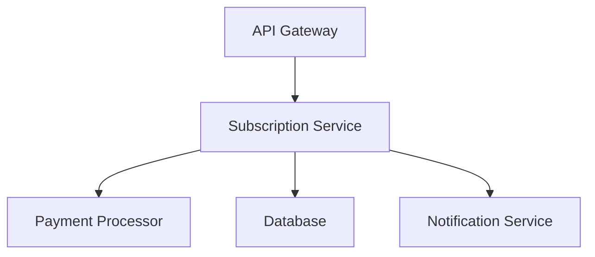

# System Architecture

This document describes the technical exposure of the subscription system.

## Components

### Core Services

### Subscription Service

The subscription service handles:

- Subscription lifecycle management
- Plan management
- Billing cycle processing
- Payment integration

### Database Layer

Key tables:

- `subscriptions` - Active and historical subscriptions
- `plans` - Available subscription plans
- `payments` - Payment transactions
- `users` - User accounts

## Technology Stack

- **Backend**: Python/Django
- **Database**: PostgreSQL
- **Cache**: Redis
- **Payment**: Stripe API